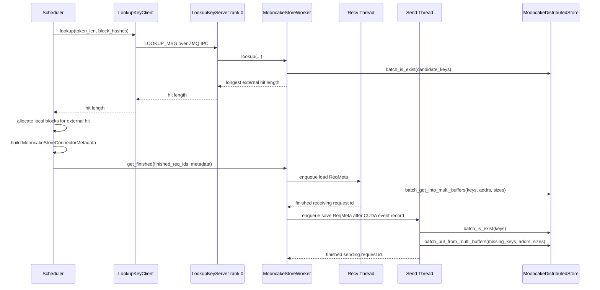

# Mooncake Store Connector

This document describes the implementation of `MooncakeStoreConnector`, the
vLLM V1 KV connector that uses `MooncakeDistributedStore` as a shared external
KV cache pool.

For deployment examples and Mooncake setup commands, see
[MooncakeStoreConnector Usage Guide](../features/mooncake_store_connector_usage.md).

## What It Does

`MooncakeStoreConnector` stores and loads full KV cache blocks by block hash.
It is different from `MooncakeConnector`, which transfers KV directly between a
prefill instance and a decode instance. With the store connector, each vLLM
process independently writes to and reads from a Mooncake-backed key-value pool.

The connector supports three main use cases:

- CPU or disk KV offload through Mooncake's distributed store.
- Prefix-cache sharing across vLLM instances that use the same block hashes.
- Hybrid KV cache models, where different KV cache groups may have different
  block reachability rules.

## File Map

| File | Responsibility |
| --- | --- |
| `connector.py` | vLLM connector adapter. Splits scheduler and worker roles, validates unsupported cache layouts, delegates lifecycle methods, exposes KV events and stats. |
| `scheduler.py` | Scheduler-side state machine. Performs external prefix lookups, tracks request allocation state, and emits per-step metadata for the worker. |
| `worker.py` | Worker-side Mooncake integration. Initializes `MooncakeDistributedStore`, registers KV buffers, starts transfer threads, serves lookup/reset RPCs, and records metrics. |
| `data.py` | Data model for store keys, token-to-block addressing, request tracking, load specs, and connector metadata. |
| `coordinator.py` | External-store cache coordinator. Mirrors vLLM hybrid KV cache hit and reachability logic over store existence results. |
| `metrics.py` | Serializable operation stats and Prometheus metrics for Mooncake store RPCs. |
| `protocol.py` | ZMQ admin-channel wire tags for lookup and reset requests. |

The connector is registered as `MooncakeStoreConnector` in
`vllm/distributed/kv_transfer/kv_connector/factory.py`.

## Key Classes

| Class | Location | Role |
| --- | --- | --- |
| `MooncakeStoreConnector` | `connector.py` | Public connector entrypoint used by vLLM. Creates either `MooncakeStoreScheduler` or `MooncakeStoreWorker` depending on role. |
| `MooncakeStoreScheduler` | `scheduler.py` | Runs on the scheduler side. Checks external hits, records `LoadSpec`s, builds `MooncakeStoreConnectorMetadata`, and decides whether finished request blocks must stay pinned for async save. |
| `MooncakeStoreWorker` | `worker.py` | Runs on model worker processes. Owns the Mooncake store handle, buffer registration, transfer threads, lookup server, and per-operation stats. |
| `KVCacheStoreSendingThread` | `worker.py` | Background thread that writes missing KV blocks to Mooncake using `batch_put_from_multi_buffers`. |
| `KVCacheStoreRecvingThread` | `worker.py` | Background thread that loads KV blocks from Mooncake using `batch_get_into_multi_buffers`. |
| `LookupKeyServer` / `LookupKeyClient` | `worker.py` | Scheduler-to-worker rank 0 ZMQ channel for prefix lookups and store resets. |
| `MooncakeStoreCoordinator` | `coordinator.py` | Computes lookup, store, and load masks that match vLLM's hybrid KV cache semantics. |
| `ChunkedTokenDatabase` | `data.py` | Converts token ranges and block hashes into store keys and GPU memory address/size lists. |
| `ReqMeta` | `data.py` | Per-request work item passed from scheduler to worker. Carries either a save request or a load request, but never both when the load is active. |

## High-Level Flow



The connector intentionally issues load and store work from
`MooncakeStoreWorker.get_finished()`. At that point model compute has already
been launched, so Mooncake I/O can overlap with GPU work.

## Store Keys and Addressing

`PoolKey` is the external-store key. Its string format is:

```text
<model>@tp_rank:<tp>@pcp<pcp>@dcp<dcp>@pp_rank:<pp>@group:<group>@<chunk_hash>
```

The key metadata includes:

- model name, using the final component of `model_config.model`;
- tensor parallel rank, adjusted to `head_or_tp_rank` when KV heads are fewer
  than TP ranks;
- prefill context parallel rank;
- decode context parallel rank;
- pipeline parallel rank;
- KV cache group id.

`ChunkedTokenDatabase` maps token ranges to `(start, end, PoolKey)` tuples and
maps local block ids to GPU addresses:

- `process_tokens()` yields full store chunks up to `token_len`. If the vLLM
  hash block size is smaller than a group's KV block size, it wraps the raw
  hashes in `BlockHashListWithBlockSize` so several fine-grained hashes form one
  group-level chunk hash.
- `prepare_value()` returns the address list, size list, and local block id for
  a token range. The address and size lists are the scatter-gather buffers passed
  to Mooncake's multi-buffer APIs.

KV cache buffer registration happens in `MooncakeStoreWorker.register_kv_caches`.
The worker registers each unique underlying storage with Mooncake, then infers
segments from tensor strides:

- blocks-first layouts, such as FlashInfer or MLA layouts, produce one segment;
- K/V-first layouts, such as FlashAttention layouts, produce one segment per
  outer K/V slice;
- cross-layer blocks are wrapped as a single pseudo-layer and use one segment
  whose block length covers all packed layers.

## Connector Adapter

`MooncakeStoreConnector` is a thin adapter around the scheduler and worker
components:

- In scheduler role, it creates `MooncakeStoreScheduler`.
- In worker role, it creates `MooncakeStoreWorker`.
- `prefer_cross_layer_blocks` reads
  `kv_connector_extra_config["enable_cross_layers_blocks"]`.
- Worker-side layerwise hooks are no-ops because store I/O is request-level, not
  layer-level.
- `reset_cache()` is implemented only for the scheduler role. It clears local
  scheduler references and routes a reset command to worker rank 0.
- `shutdown()` closes the worker's `MooncakeDistributedStore` handle.

The connector rejects unsupported KV cache configurations:

- cross-attention cache specs;
- Mamba cache specs whose block size is not aligned with
  `cache_config.block_size`;
- hybrid attention with PCP/DCP greater than 1.

## Scheduler Side

### External Hit Lookup

`MooncakeStoreScheduler.get_num_new_matched_tokens()` is called while scheduling
a request. It:

1. Floors the request length to a full scheduler block.
2. Calls `LookupKeyClient.lookup()` with the block hashes.
3. If the store reports a full prompt hit, backs off to
   `(request.num_tokens - 1) // block_size * block_size` so sampling still has a
   local tail to compute.
4. Compares the external hit length with the already-computed local prefix.
5. Records a `LoadSpec` with `can_load=False` until local blocks are allocated.
6. Returns the number of external tokens that the scheduler should allocate
   slots for, plus whether async load is enabled.

`update_state_after_alloc()` records unfinished request state and flips
`LoadSpec.can_load` to true only after the scheduler has allocated exactly the
local blocks needed for the external hit.

### Metadata Construction

`build_connector_meta()` creates a `MooncakeStoreConnectorMetadata` object for
each scheduler step. It handles several request categories:

- finished requests: remove stale load specs, trackers, unfinished state, and
  preemption markers;
- preempted requests: clear stale load state and reset request trackers;
- new requests: create a `RequestTracker`, attach any active `LoadSpec`, and
  create a `ReqMeta`;
- cached/running requests: append newly allocated blocks and save newly full
  blocks while the request is still in the prefill range;
- resumed-from-preemption requests: rebuild a tracker from the request's full
  token list and optionally attach a load spec;
- pending loads that were allocated but not scheduled this step: emit a load
  `ReqMeta` without also queuing a save.

For `kv_consumer` role, saves are force-skipped. For producer or both roles,
`request_finished()` delays freeing local blocks when the request has saved
tokens and an async store operation may still reference those blocks.

`ReqMeta.from_request_tracker()` centralizes an important invariant: an active
load and a save are not co-queued on the same `ReqMeta`. If `load_spec.can_load`
is true, save is forced off for that metadata item.

## Worker Initialization

`MooncakeStoreWorker` imports `MooncakeDistributedStore` and `ReplicateConfig`
from `mooncake.store`, then derives the local rank metadata:

- DP engine index for Mooncake side channels;
- TP rank and TP size;
- PP rank and PP size;
- PCP and DCP ranks;
- `head_or_tp_rank` and `put_step` when KV heads are fewer than TP ranks.

`MooncakeStoreConfig` is loaded from `MOONCAKE_CONFIG_PATH`. It supports:

- `embedded` mode, where each vLLM rank contributes `global_segment_size`;
- `standalone-store` mode, where vLLM contributes no global segment and an
  external Mooncake client owns the pool;
- `enable_offload`, which enables requester-side disk staging-budget logic.

The worker calls:

```python
store.setup(
    local_hostname,
    metadata_server,
    global_segment_size,
    local_buffer_size,
    protocol,
    device_name,
    master_server_address,
)
```

If a preferred segment is configured, it is written into the Mooncake
`ReplicateConfig` used by store puts. Worker rank 0 also creates a
`LookupKeyServer` so scheduler-side prefix lookups and resets have a single
admin endpoint.

The worker creates a `MooncakeStoreCoordinator` and one `ChunkedTokenDatabase`
per KV cache group. For single-group PCP/DCP cases where the group block size
differs from the scheduler block size, the group spec is copied with the
scheduler block size so coordinator invariants remain valid.

## Send Path

`KVCacheStoreSendingThread` stores computed KV blocks.

The save path is:

1. Floor `req_meta.token_len_chunk` to the coordinator's LCM block size.
2. Skip the request if it is no longer tracked or has no full chunks to store.
3. Ask `MooncakeStoreCoordinator.store_mask()` which per-group chunks should be
   persisted. This keeps Mooncake aligned with vLLM local prefix-cache
   reachability rules.
4. Convert token ranges to keys and address/size lists with
   `ChunkedTokenDatabase`.
5. Apply `put_step` striding so TP ranks avoid duplicate writes when multiple
   TP ranks share the same KV heads.
6. Call `store.batch_is_exist(keys)` and keep only missing keys.
7. Synchronize the recorded CUDA event so GPU writes are visible before
   Mooncake reads from the registered buffers.
8. Call `store.batch_put_from_multi_buffers(keys, addrs, sizes, replicate_config)`.
9. Record metrics and optional `BlockStored` KV events.
10. Mark the request's save work complete so delayed block freeing can proceed.

If a Mooncake put returns `MOONCAKE_NO_AVAILABLE_HANDLE`, the sender treats that
as CPU/disk offload pressure and skips future store batches for the same request
until a later batch succeeds. The thread decrements its per-request in-flight
counter in a `finally` block so pinned blocks can be released even after errors.

## Load Path

`KVCacheStoreRecvingThread` loads blocks into local GPU KV cache buffers.

The load path is:

1. Read the active `LoadSpec` from `ReqMeta`.
2. Use `vllm_cached_tokens` to skip chunks already present in the local vLLM
   cache.
3. Ask `MooncakeStoreCoordinator.load_mask()` which chunks the local cache group
   should actually populate. For example, SWA groups skip pre-window blocks.
4. Convert keys to address/size lists with `ChunkedTokenDatabase.prepare_value`.
5. Rotate the key/address/size lists by TP rank to distribute load pressure.
6. If disk offload is enabled, split large loads into sub-batches that fit the
   Mooncake DirectIO staging-buffer budget.
7. Call `store.batch_get_into_multi_buffers(keys, addrs, sizes)`.
8. Record metrics, optional tier summary logs, and any failed local block ids.
9. Mark the request as finished receiving.

Disk-offload splitting uses `_estimate_disk_offload_staging_bytes()`, which sums
all buffer segments for a key, aligns to DirectIO boundaries, and adds padding.
`VLLM_MOONCAKE_DISK_STAGING_USABLE_RATIO` controls how much of the raw staging
budget one sub-batch may use. If a single key is larger than the raw budget, the
thread skips the whole request and marks all attempted blocks invalid.

Workers expose `get_block_ids_with_load_errors()` so the engine can discover
local blocks that should not be trusted after a failed load.

## Lookup and Reset Channel

The scheduler cannot call Mooncake directly, so it uses a local ZMQ REQ/REP IPC
channel to worker rank 0:

- `LookupKeyClient.lookup()` sends `LOOKUP_MSG`, a 4-byte big-endian token
  length, and msgpack-encoded block-hash hex strings.
- `LookupKeyServer` decodes the request, calls `MooncakeStoreWorker.lookup()`,
  and returns a 4-byte big-endian hit length.
- `LookupKeyClient.reset()` sends `RESET_MSG`.
- `LookupKeyServer` drains the send-thread queue, then calls
  `store.remove_all(force=True)` and returns `RESP_OK` or `RESP_ERR`.

The IPC path includes the base RPC path, optional `lookup_rpc_port`, hostname,
and Mooncake DP engine index. This keeps multiple local engines from colliding.

### Lookup Semantics

`MooncakeStoreWorker.lookup()` expands candidate keys across:

- every relevant KV cache group;
- every reachable chunk selected by `MooncakeStoreCoordinator.lookup_mask()`;
- every TP rank that owns KV heads;
- every PP rank.

A `(group_id, hash)` is considered present only when all expected TP and PP
rank keys exist. The worker then passes the present set to
`MooncakeStoreCoordinator.find_longest_cache_hit()` to compute the longest valid
prefix length. This final step is what makes lookup correct for hybrid cache
specs instead of simply returning the first missing full-attention block.

## Hybrid KV Cache Coordination

`MooncakeStoreCoordinator` mirrors the core vLLM hybrid-cache hit logic without
allocating a real `BlockPool`.

The key helper is `ExternalCachedBlockPool`, a small duck-typed block pool that
answers `get_cached_block()` from a set of `(group_id, hash)` entries. The
coordinator feeds this into each cache spec manager's existing methods, so the
Mooncake store follows the same rules as local prefix caching.

The coordinator provides three masks:

- `store_mask(aligned_token_len, num_prompt_tokens)`: chunks that should be
  written to the external store. It respects the configured prefix-cache
  retention interval.
- `lookup_mask(aligned_token_len)`: chunks that should be checked during lookup.
  It ignores retention so earlier reusable boundaries are still discoverable.
- `load_mask(block_hashes, token_len)`: chunks the consumer should load into its
  local KV cache for the already-known hit length.

The implementation handles:

- full attention groups;
- sliding-window attention groups;
- Mamba and other registered KV cache specs;
- groups with block sizes larger than the hash block size;
- EAGLE, where lookup drops the final drafter block but load masks avoid
  applying that pruning a second time.

## Observability

`MooncakeStoreConnectorStats` records one row per Mooncake operation:

- `lookup_exists`
- `save_exists`
- `save_put`
- `load_get`

Each row includes duration, key count, byte count, status, and failed-key count.
`reduce()` summarizes counts, average and p90 latency, total keys, total bytes,
failed keys, and error counts.

`MooncakeStorePromMetrics` exposes the same data as Prometheus metrics:

- `vllm:mooncake_store_operation_time_seconds`
- `vllm:mooncake_store_operation_total`
- `vllm:mooncake_store_operation_keys_total`
- `vllm:mooncake_store_operation_bytes_total`
- `vllm:mooncake_store_operation_failed_keys_total`

When KV cache events are enabled, successful store operations emit
`BlockStored` events. Events include block hashes, parent block hash within a
group, token ids when available, block size, medium, and group index.

`VLLM_MOONCAKE_STORE_TIER_LOG=1` enables per-load tier summaries. The receiver
asks Mooncake for replica descriptors before the load and logs memory, disk, and
unknown key counts plus successful bytes by tier.

## Important Invariants

- Store operations only write full chunks aligned to the scheduler LCM block
  size.
- Active load metadata does not also request a save for the same request step.
- A store key includes group, TP, PCP, DCP, and PP metadata, so keys are isolated
  by parallel-layout context.
- External lookup requires all expected TP and PP rank keys for a chunk before
  considering that chunk present.
- Hybrid masks are computed through vLLM cache-spec managers, not with
  connector-local SWA or Mamba heuristics.
- The reset path assumes the caller has paused generation and no new Mooncake
  operations are being enqueued while reset drains existing stores.

## Test Coverage

The main unit tests live under `tests/v1/kv_connector/unit/`:

- `test_mooncake_store_connector.py` covers connector delegation, protocol
  tags, reset behavior, shutdown, events, and stats construction.
- `test_mooncake_store_scheduler.py` covers metadata construction, pending-load
  races, preemption, full external hits, and the no-load-plus-save invariant.
- `test_mooncake_store_worker.py` covers config parsing, topology setup,
  buffer registration, send/load error handling, disk-offload splitting,
  lookup semantics, metrics, and close behavior.
- `test_mooncake_store_coordinator.py` covers full attention, SWA, hybrid cache
  convergence, retention masks, group block-size differences, and EAGLE pruning.
- `test_mooncake_store_hma_e2e.py` provides a dictionary-backed end-to-end test
  for hybrid model architecture save, lookup, and receive behavior.
